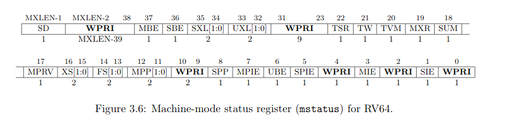
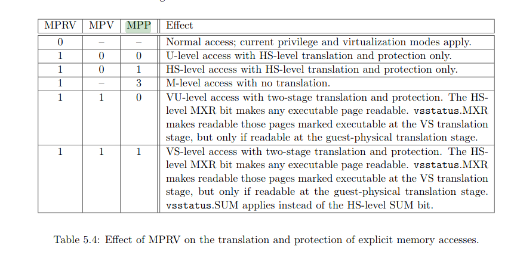

# Overview of CSRs

WARL registers allow anything to be written but the result is always a legal value. If the Write was an illegal value, the resulting contents of the register default in some deterministic way to become legal.

## Mstatus

This is perhaps the most complicated csr in riscv. It consists of the following parts:

| name | explanation |
| --- | --- |
| SD | The SD bit is a read-only bit that summarizes whether either the FS field or XS field signals the presence of some dirty state that will require saving extended user context to memory. If both XS and FS are hardwired to zero, then SD is also always zero. |
| WPRI | As far as I know: Reserved |
| MBE   SBE   UBE | The MBE, SBE, and UBE bits in `mstatus` and `mstatush` are WARL fields that control the endianness of memory accesses other than instruction fetches. Instruction fetches are always little-endian. (0 for little endian, 1 for big endian) |
| SXL   UXL | For RV64 systems, the SXL and UXL fields are WARL fields that control the value of XLEN for S-mode and U-mode, respectively. The encoding of these fields is the same as the MXL field of misa, (1=32bit, 2=64bit, 3=128bit) The effective XLEN in S-mode and U-mode are SXLEN and UXLEN, respectively. On RV32 these fields don't exist and XLEN is always 32 bits. |
| TSR | The TSR (Trap SRET) bit is a WARL field that supports intercepting the supervisor exception return instruction, SRET. When TSR=1, attempts to execute SRET while executing in S-mode will raise an illegal instruction exception. When TSR=0, this operation is permitted in S-mode.TSR is hard-wired to 0 when S-mode is not supported. |
| TW | The TW (Timeout Wait) bit is a WARL field that supports intercepting the WFI instruction [(see Section 3.2.3)](static/riscv-privileged-latest(experimental).pdf). When TW=0, the WFI instruction may execute in lower privilege modes whennot prevented for some other reason. When TW=1, then if WFI is executed in any less-privilegedmode, and it does not complete within an implementation-specific, bounded time limit, the WFI instruction causes an illegal instruction exception. The time limit may always be 0, in which case WFI always causes an illegal instruction exception in less-privileged modes when TW=1. TW is hard-wired to 0 when there are no modes less privileged than M. |
| TVM | The TVM (Trap Virtual Memory) bit is a WARL field that supports intercepting supervisorvirtual-memory management operations. When TVM=1, attempts to read or write the satp CSR or execute the SFENCE. VMA instruction while executing in S-mode will raise an illegal instruction exception. When TVM=0, these operations are permitted in S-mode. TVM is hard-wired to 0 whenS-mode is not supported. |
| MXR | The MXR (Make eXecutable Readable) bit modifies the privilege with which loads access virtual memory. When MXR=0, only loads from pages marked readable will succeed. When MXR=1, loads from pages marked either readable or executable (R=1 or X=1) will succeed. MXR has no effect when page-based virtual memory is not in effect.
| SUM | The SUM (permit Supervisor User Memory access) bit modifies the privilege with which S-mode loads and stores access virtual memory. When SUM=0, S-mode memory accesses to pages that are accessible by U-mode will fault. When SUM=1, these accesses are permitted. SUM has no effect when page-based virtual memory is not in effect, nor when executing in U-mode.Note that S-mode can never execute instructions from user pages, regardless of the state of SUM.
| MPRV | TODO |
| XS | TODO |
| FS | TODO |
| MPP |  |
| SPP | 
| MPIE |
| SPIE |
| MIE |
| SIE |
| MPV | TOdO

